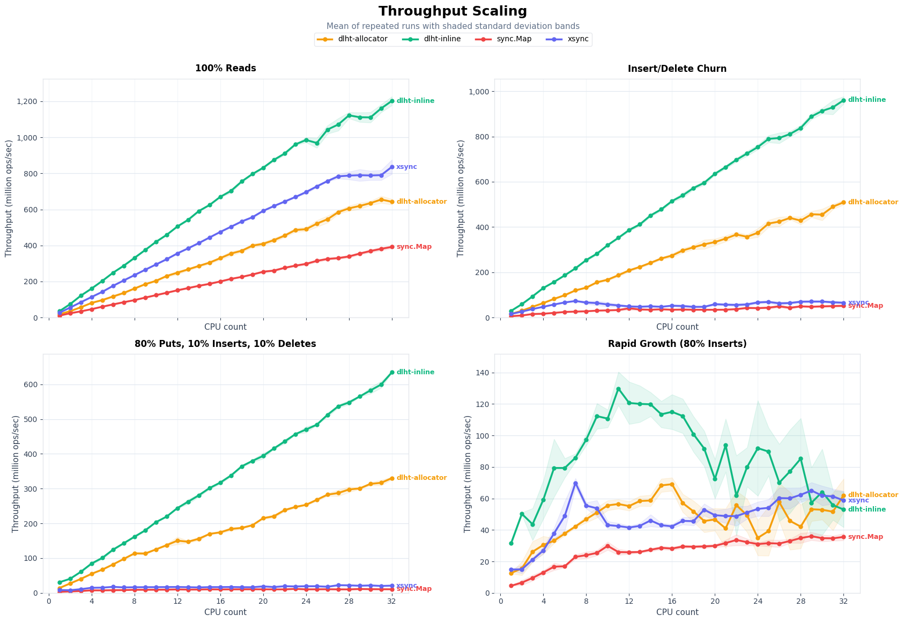
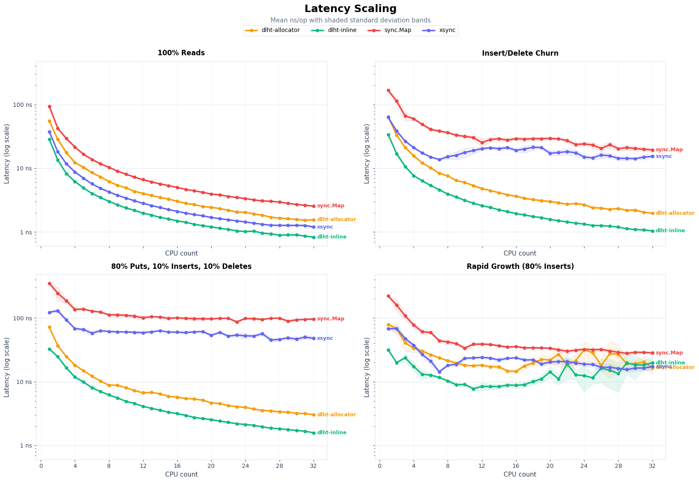

# DLHT

DLHT is a high-performance, lock-free hash table for high-concurrency workloads based on DLHT: A Non-blocking Resizable Hashtable with Fast Deletes and Memory-awareness (<https://arxiv.org/abs/2406.09986>). It provides lock-free Get, Insert, Delete, and Put operations with sophisticated memory ordering and cooperative resizing.

## Features

- **Lock-free operations**: All operations (Get, Insert, Delete, Put) are lock-free and linearizable
- **High concurrency**: Scales well with multiple threads and cores
- **Automatic resizing**: Cooperative resize algorithm that doesn't block operations
- **Memory efficient**: Cache-line optimized data structures with bounded overflow
- **Type safe**: Generic implementation supporting any comparable key type and any value type

## Quick Start

```go
package main

import (
    "fmt"
    "github.com/jeremiah-masters/dlht"
)

func main() {
    // Create a new DLHT
    m := dlht.New[string, int](dlht.Options{InitialSize: 64})

    // Insert key-value pairs
    m.Insert("apple", 5)
    m.Insert("banana", 3)

    // Get values
    if value, found := m.Get("apple"); found {
        fmt.Printf("Found: apple = %d\n", value)
    }

    // Update values atomically
    if oldValue, updated := m.Put("apple", 10); updated {
        fmt.Printf("Updated apple: %d -> %d\n", oldValue, 10)
    }

    // Delete keys
    if oldValue, deleted := m.Delete("banana"); deleted {
        fmt.Printf("Deleted banana (old value: %d)\n", oldValue)
    }

    // Get statistics
    stats := m.Stats()
    fmt.Printf("Load factor: %.3f\n", stats.LoadFactor)
}
```

## API Reference

### Types

- `Map[K Key, V any]`: The main hash table type
- `Entry[K Key, V any]`: A key-value pair
- `Options`: Configuration options for creating a new map
- `Stats`: Statistics about the hash table's current state
- `Key`: Type constraint for valid key types (uint64 or string)

### Functions

- `New[K Key, V any](opts Options) *Map[K, V]`: Create a new DLHT
- `(m *Map[K, V]) Get(key K) (V, bool)`: Get a value by key
- `(m *Map[K, V]) Insert(key K, value V) (V, bool)`: Insert a new key-value pair
- `(m *Map[K, V]) Put(key K, value V) (V, bool)`: Update an existing key atomically
- `(m *Map[K, V]) Delete(key K) (V, bool)`: Delete a key and return the old value
- `(m *Map[K, V]) Stats() Stats`: Get current statistics

## Implementation Details

This package provides a clean public API that wraps the allocator-based implementation. The project contains two lock-free variants built on the same core design:

- **`allocator/`**: Generic implementation used by `dlht.New`; each slot stores a hash plus a pointer to a heap-allocated entry, supporting arbitrary comparable keys and values.
- **`inline/`**: Specialized implementation exposed by `dlht.NewInline`; each slot stores the value inline for `uint64` keys and integer values, avoiding per-entry allocation in that path.

## Performance

DLHT is designed for high-performance concurrent workloads:

- **Lock-free**: No blocking between operations
- **Cache-optimized**: 64-byte buckets fit exactly in cache lines
- **Bounded overflow**: Maximum 15 slots per bucket for predictable performance
- **Cooperative resizing**: Non-blocking resize with work-stealing

## Benchmarks

The charts below compare DLHT against `sync.Map` and other popular concurrent map implementations across four representative workloads as core count scales. Benchmarks were run on an Intel Xeon Platinum 8260 (2.40GHz); raw data is in [benchmarks/results/results.txt](benchmarks/results/results.txt).

### Throughput Scaling



### Latency Scaling



Panels cover read-only reads, insert/delete churn, a put-heavy mix, and rapid growth (80% inserts). See [benchmarks/workload.go](benchmarks/workload.go) for the full workload definitions and [benchmarks/throughput_test.go](benchmarks/throughput_test.go) for the harness.

## License

Licensed under Apache v2.
