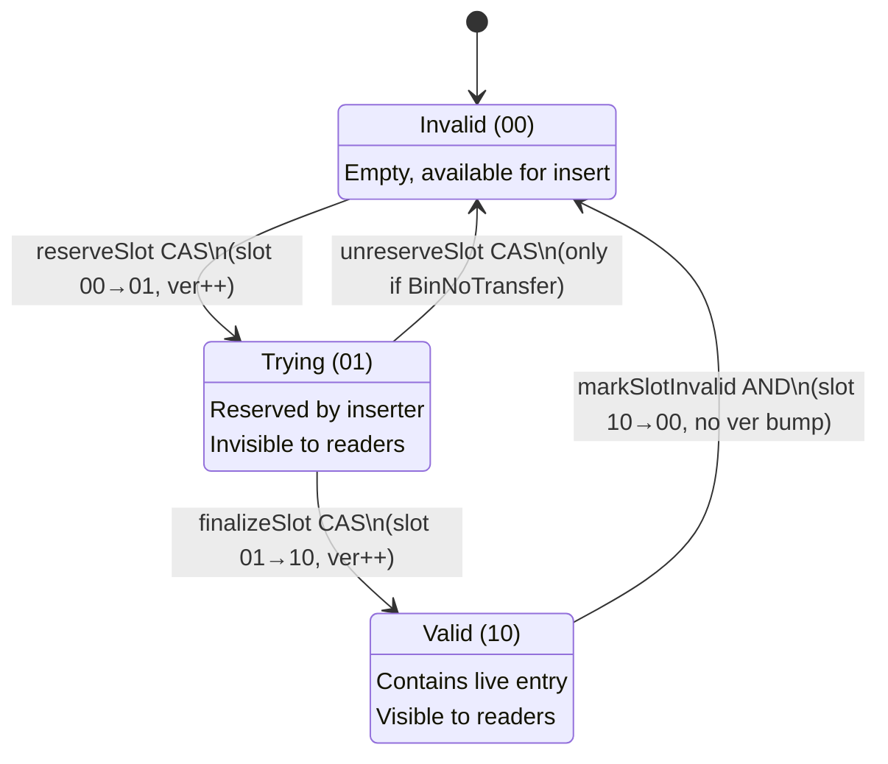

# DLHT: A Lock-Free Concurrent Hash Table

## Introduction

DLHT implements a lock-free concurrent hash table based on the DLHT algorithm from HPDC'24. This document explains not just *what* the implementation does, but *why* each design decision was made and how the pieces fit together to achieve correctness under arbitrary concurrency.

The fundamental challenge of concurrent hash tables is allowing multiple threads to read and write simultaneously without corrupting data or losing updates. Traditional approaches use locks, which serialize access and limit scalability. DLHT instead uses atomic operations and careful memory ordering to achieve lock-freedom: any thread can make progress regardless of what other threads are doing.

---

## The Core Insight: Separating Visibility from Data

The key insight behind DLHT's design is separating the *visibility* of an entry from its *data*. An entry exists in two places: the slot (which holds a hash and pointer) and the Entry struct (which holds the actual key and value). The slot's *state* in the header determines whether readers can see it.

This separation enables a powerful pattern: we can prepare data in a slot while it's invisible, then atomically make it visible. Conversely, we can atomically make a slot invisible, then clean up the data at leisure. This is the foundation of lock-free operation.

Consider what happens without this separation. If we wrote the key and value directly into the slot, a reader might see a partially-written key or a key without its value. With separation, readers either see a complete entry (slot is Valid) or nothing at all (slot is Invalid or Trying).

---

## Data Structures: How Memory is Organized

### The Map and Index

A DLHT consists of a `Map` struct that holds a pointer to the current `Index`. The Index contains the actual hash table: an array of primary buckets and an arena of link buckets for overflow.

```go
type Map[K Key, V any] struct {
    _ structs.HostLayout

    active     atomic.Pointer[index[K, V]]        // Current index (hot path, every operation)
    hashConfig HashConfig                         // Hash seed (read once per op)
    _          [cpu.CacheLineSize - 16]byte       // Pad active+hashConfig to a full cache line
    resizeCtx  atomic.Pointer[resizeContext[K, V]] // Resize coordination (cold path)
}

type index[K Key, V any] struct {
    _ structs.HostLayout

    mask         uint64                       // = len(bins) - 1, for fast modulo
    bins         []PrimaryBucket[K, V]        // Power-of-2 sized bucket array
    links        []LinkBucket[K, V]           // Overflow link arena
    _            [cpu.CacheLineSize - 56]byte // Pad metadata to a full cache line
    linkNext     uint32                       // Next link to allocate (atomic FAA, from bottom)
    linkCapacity uint32                       // Max allocatable link index for foreground inserts
    indexNext    atomic.Pointer[index[K, V]]  // Successor index; set before transfer begins
}
```

The padding between `active`/`hashConfig` and `resizeCtx` isn't wasted space—it ensures these two groups of fields live on different CPU cache lines. Without this padding, a thread modifying `resizeCtx` during resize would invalidate the cache line containing `active`, forcing all other threads to re-fetch it from main memory. This "false sharing" can devastate performance on multi-core systems. The padding is sized via `cpu.CacheLineSize` so it adapts per platform: 48 bytes on amd64 (64-byte cache lines) and 112 bytes on arm64 (128-byte cache lines—Apple M-series and most modern ARM servers).

The Index holds a `mask` field that's always one less than the number of bins (which is always a power of two). This allows computing `binIndex = hash & mask` instead of the much slower `hash % numBins`. A single AND instruction replaces division.

The `indexNext` field is critical for cooperative resize. When a resize begins, the current index publishes a pointer to the new, larger index via `indexNext` *before* transferring any bins. This lets an operation that's multiple resize generations behind walk the chain of indexes in order, preserving the invariant that every write to a bin happens after that bin has been transferred into its generation. Operations never load "the latest index" and skip ahead—they always follow `indexNext` from the index where they first noticed a `BinDoneTransfer`. The Resize section explains why this matters.

### Cache-Line Alignment: GC-Safe Rotated Layouts

For the seqlock pattern to perform well, a primary bucket's header, LinkMeta, and slots must all live on the same cache line. Go's allocator only guarantees 8-byte alignment for slices, but on amd64 we need 64-byte alignment (128 on arm64). The naive fix—reinterpret a larger buffer at the first aligned offset—breaks Go's garbage collector, which expects pointers at specific offsets within a `PrimaryBucket`. If we slide the start of the slice into the middle of the original struct, pointer fields end up at the wrong offsets and the GC can miss them.

`makePrimaryAlignedSlice` handles this by allocating into an alternative struct layout when the underlying allocation's offset relative to a cache line happens to be 8 bytes (the other common case Go's allocator produces):

```go
type PrimaryBucketRot8[K Key, V any] struct {
    LinkMeta LinkMeta
    Slots    [3]Slot[K, V]
    Header   Header
}
```

`PrimaryBucketRot8` rotates the fields so that when we reinterpret the slice starting at a cache-line boundary inside the buffer, the pointer fields (`Slots[i].Val`) sit at the same absolute offsets they would occupy in a correctly-aligned `PrimaryBucket`. The GC traces pointers by their addresses relative to the allocation, so placing them at the right absolute positions is what matters—the GC doesn't care what type name we apply via `unsafe.Slice`. `LinkBucketRot8` applies the same trick to link buckets (which are 64 bytes of alternating `uint64`/pointer pairs). If the allocation lands at an offset we don't handle, the code falls back to a buffer large enough to force `mallocgc` into a heap allocation, which is always cache-line aligned.

### Primary Buckets: One Cache Line, One Unit of Work

Each primary bucket occupies exactly 64 bytes—one CPU cache line on most modern processors. This is deliberate: when a thread accesses a bucket, it fetches exactly one cache line from memory, and that cache line contains everything needed for most operations.

```
Primary Bucket Array (N × 64B)                     Link Bucket Arena (M × 64B)
┌─────────────────────────────────────────────┐   ┌───────────────────────────┐
│ ┌──────────────┐ ┌──────────────┐ ┌───────┐ │   │ ┌─────────────┐ ┌───────┐ │
│ │   Bucket[0]  │ │   Bucket[1]  │ │  ...  │ │   │ │LinkBucket[0]│ │  ...  │ │
│ │              │ │              │ │       │ │   │ │             │ │       │ │
│ │┌────────────┐│ │┌────────────┐│ │       │ │   │ │┌────┬──────┐│ │       │ │
│ ││   Header   ││ ││   Header   ││ │       │ │   │ ││ K0 │  V0  ││ │       │ │
│ ││    (8B)    ││ ││    (8B)    ││ │       │ │   │ │├────┼──────┤│ │       │ │
│ │├────────────┤│ │├────────────┤│ │       │ │   │ ││ K1 │  V1  ││ │       │ │
│ ││  LinkMeta  ││ ││  LinkMeta  ││ │       │ ├───┼─┤├────┼──────┤│ │       │ │
│ ││    (8B)    ││ ││    (8B)    ││ │       │ │   │ ││ K2 │  V2  ││ │       │ │
│ │├────┬───────┤│ │├────┬───────┤│ │       │ │   │ │├────┼──────┤│ │       │ │
│ ││ K0 │  V0   ││ ││ K0 │  V0   ││ │       │ │   │ ││ K3 │  V3  ││ │       │ │
│ │├────┼───────┤│ │├────┼───────┤│ │       │ │   │ │└────┴──────┘│ │       │ │
│ ││ K1 │  V1   ││ ││ K1 │  V1   ││ │       │ │   │ └─────────────┘ └───────┘ │
│ │├────┼───────┤│ │├────┼───────┤│ │       │ │   └───────────────────────────┘
│ ││ K2 │  V2   ││ ││ K2 │  V2   ││ │       │ │
│ │└────┴───────┘│ │└────┴───────┘│ │       │ │
│ └──────────────┘ └──────────────┘ └───────┘ │
└─────────────────────────────────────────────┘
         3 slots each                                       4 slots each
```

The bucket layout places the header first because every operation reads it first to check bin state and slot validity. LinkMeta comes second because it's only accessed when primary slots don't contain the key—a less common path. The three slots fill the remainder.

### The Header: 64 Bits of Coordination

The header is the coordination point for all concurrent access to a bucket. It packs three pieces of information into 64 bits:

```
┌─────────────────────────────────────────────────────────────────────────────┐
│                              Header (64 bits)                               │
├─────────────────────┬─────────────┬─────────────────────────────────────────┤
│      Version        │  BinState   │           Slot States                   │
│      (32 bits)      │  (2 bits)   │            (30 bits)                    │
├─────────────────────┼─────────────┼─────────────────────────────────────────┤
│ Bumped by reserve/  │ 00: Normal  │ 2 bits per slot (15 slots total):       │
│ finalize/unreserve  │ 01: InTrans │                                         │
│ CASes (seqlock ver) │ 10: Done    │ Bits 0-5:   Primary slots 0-2           │
│                     │             │ Bits 6-13:  Single link slots 0-3       │
│                     │             │ Bits 14-29: Pair link slots 0-7         │
└─────────────────────┴─────────────┴─────────────────────────────────────────┘
```

The 32-bit version counter serves as a "seqlock"—a technique borrowed from the Linux kernel. Most modifications to the header increment this counter (reserveSlot, finalizeSlot, unreserveSlot CASes all do). Readers load the version before reading slot data, then load it again after. If the versions differ, something changed during the read, and the reader must retry.

A few fast-path modifications—`markSlotInvalid`'s atomic AND (Delete cleanup), the `atomic.OrUint64` that sets `BinInTransfer`, and the plain atomic store that sets `BinDoneTransfer`—don't explicitly increment the counter, but they change the header's *bit pattern*. For the seqlock, that's the operational property that matters: readers compare the entire 64-bit header before and after, so any modification that changes any bit of it forces a retry. The version counter is there to defend against the narrower case where the bit pattern would otherwise coincidentally repeat—for example, a state transition `Invalid → Trying → Invalid` ends with the same state bits it started with. Because every Trying/Valid transition increments the version, the cycle cannot alias.

This allows readers to proceed without taking locks while guaranteeing they never see torn or inconsistent data.

The 2-bit bin state tracks resize progress. A bin starts in NoTransfer (00), transitions to InTransfer (01) when being moved, and ends at DoneTransfer (10) when migration completes. Operations check this state and redirect to the new index when necessary.

The remaining 30 bits encode states for up to 15 slots (2 bits each). Each slot can be Invalid (00), Trying (01), or Valid (10). Only Valid slots are visible to readers. The Trying state is crucial for insert atomicity—it marks a slot as "claimed but not yet published."

### Slots and Entries: The Two-Level Structure

Each slot is exactly 16 bytes: an 8-byte hash and an 8-byte pointer. This size is critical because it matches the width of DWCAS (double-width compare-and-swap) instructions available on modern CPUs.

```go
type Slot[K Key, V any] struct {
    _ structs.HostLayout

    Key uint64       // Hash of the actual key
    Val *Entry[K, V] // Pointer to key-value pair
}

type Entry[K Key, V any] struct {
    _ structs.HostLayout

    Key   K
    Value V
}
```

(The `structs.HostLayout` marker, introduced in Go 1.24, asks the compiler to follow the platform's native struct layout rules rather than any future optimization that might reorder fields—essential for code that reinterprets memory via `unsafe` or assembly.)

Why store the hash rather than the key directly? Two reasons. First, keys can be strings of arbitrary length, but slots must be fixed-size for DWCAS. Second, hash comparison is extremely fast—a single integer comparison filters out most non-matches without touching the Entry, which might be in a different cache line.

The Entry struct lives separately in heap memory. It's immutable once created: we never modify an Entry, we only replace the pointer in the slot with a pointer to a new Entry. This immutability simplifies reasoning about concurrent access.

### Link Buckets: Bounded Overflow

When a primary bucket's three slots fill up, we attach link buckets from a pre-allocated arena. The LinkMeta field in the primary bucket tracks which link buckets are attached:

```
                              LinkMeta (64 bits)
        ┌────────────────────────────┬────────────────────────────┐
   bit  │ 63                      32 │ 31                       0 │
        ├────────────────────────────┼────────────────────────────┤
        │         PairStart          │          Single            │
        │     (link pair index)      │    (single link index)     │
        └────────────────────────────┴────────────────────────────┘
                     │                            │
                     │                            └─► Index into link arena
                     │                                (0 = NO_LINK, 1+ = valid)
                     │
                     └─► Points to TWO consecutive buckets
                         [PairStart] and [PairStart+1]
```

Links attach in order: first a single link bucket (4 more slots), then a pair of link buckets (8 more slots). This gives a maximum of 15 slots per bin: 3 primary + 4 single + 8 pair. The bounded overflow means lookup time is O(15) worst case—we never chase unbounded chains.

The attachment order optimizes for common cases. Most overflow scenarios (4-7 keys hashing to the same bin) only need the single link. The pair is reserved for pathological cases or hot keys.

Link attachment uses a CAS loop on LinkMeta: allocate a link index via atomic fetch-and-add on `linkNext`, then CAS the index into LinkMeta. If the CAS fails because another thread attached first, we use their link (the allocation is "wasted" but harmless—the link arena is sized generously). This ensures exactly one single link and one pair can be attached, with clear winner semantics.

Here's what a fully-loaded bucket chain looks like:

```
Primary Bucket (64B)                  Link Arena Overview
┌───────────────────────┐             ┌───────────────────────────────────────┐
│ Header: Ver=42 Bin=00 │             │ Index: [0][1][2][3][4][5][6]          │
│ SlotStates: 10 10 10  │             │        [ ][ ][●][●][ ][●][ ]          │
│ (all 3 slots Valid)   │             │               ▲  ▲     ▲              │
├───────────────────────┤             │               │  │     │              │
│ LinkMeta (64 bits):   │             │          Pair─┼──┘     └─Single       │
│ ┌─────────┬─────────┐ │             └───────────────┼───────────────────────┘
│ │PairStart│ Single  │ │                             │
│ │    2    │    5    │ │                             │
│ └─────────┴─────────┘ │             ┌───────────────┘
├───────────────────────┤             │
│ Slot[0]: K1, V1       │             │ Link Pair: Buckets [2,3] (8 slots)
│ Slot[1]: K2, V2       │             │ ┌─────────────────┐ ┌─────────────────┐
│ Slot[2]: K3, V3       │             │ │  LinkBucket[2]  │ │  LinkBucket[3]  │
└───────────────────────┘             │ │  ┌────┬──────┐  │ │ ┌─────┬───────┐ │
                                      └─┤  │ K4 │  V4  │  │ │ │ K8  │  V8   │ │
                                        │  ├────┼──────┤  │ │ ├─────┼───────┤ │
                                        │  │ K5 │  V5  │  │ │ │ K9  │  V9   │ │
                                        │  ├────┼──────┤  │ │ ├─────┼───────┤ │
                                        │  │ K6 │  V6  │  │ │ │ K10 │  V10  │ │
                                        │  ├────┼──────┤  │ │ ├─────┼───────┤ │
                                        │  │ K7 │  V7  │  │ │ │ K11 │  V11  │ │
                                        │  └────┴──────┘  │ │ └─────┴───────┘ │
                                        └─────────────────┘ └─────────────────┘

                                        Single Link: Bucket [5] (4 slots)
                                        ┌─────────────────┐
                                        │  LinkBucket[5]  │
                                        │  ┌─────┬──────┐ │
                                        │  │ K12 │ V12  │ │
                                        │  ├─────┼──────┤ │
                                        │  │ K13 │ V13  │ │
                                        │  ├─────┼──────┤ │
                                        │  │ K14 │ V14  │ │
                                        │  ├─────┼──────┤ │
                                        │  │ K15 │ V15  │ │
                                        │  └─────┴──────┘ │
                                        └─────────────────┘

Total: 3 (primary) + 4 (single) + 8 (pair) = 15 slots maximum per bin
```

---

## The Slot State Machine

Understanding the slot state machine is essential to understanding DLHT's correctness. Each slot transitions through states according to strict rules:



**Invalid → Trying**: An inserting thread claims a slot by atomically transitioning it from Invalid to Trying. This CAS compares the entire 64-bit header, so it fails if any other thread modified anything in the bucket. The Trying state is invisible to readers (not included in validity masks) but blocks other inserters from claiming the same slot.

**Trying → Valid**: After filling the slot's data, the inserting thread "publishes" the entry by transitioning Trying to Valid. This is the linearization point—the moment the entry becomes visible. Again, the CAS compares the full header, failing if the bucket changed (e.g., resize started).

**Trying → Invalid**: If an insert needs to abort (found a duplicate key, resize started), it can unreserve the slot. This only succeeds if the bin is still in normal operation—once transfer starts, the slot belongs to the transfer process.

**Valid → Invalid**: After Delete's DWCAS clears the entry pointer, a best-effort `markSlotInvalid` transitions the slot from Valid to Invalid. Between the DWCAS and this cleanup, the slot is in a transient state (Valid in header, nil entry pointer). Readers skip it because they check `entry != nil`. The cleanup makes the slot available for reuse by Insert.

Unlike the other transitions, `markSlotInvalid` uses `atomic.AndUint64` to clear the slot's two state bits unconditionally, with no CAS loop and no version bump. This is safe because:

- Readers still detect the change: the bit transition `10 → 00` makes the post-read header differ from the pre-read header, so the seqlock check retries.
- ABA is impossible: any subsequent Insert re-using this slot performs a reserve CAS that *does* bump the version, so a reader cannot be fooled into accepting a stale snapshot by a coincidence of bit patterns.
- No precondition check is needed: the slot must be Valid (the DWCAS just succeeded), the entry pointer must be nil (the DWCAS set it), and resize only cares about entry pointers, not slot states.

Dropping the CAS loop here eliminates spinning on header contention during the delete-cleanup path.

The critical invariant for the CAS-based transitions (reserve, finalize, unreserve) is that they compare the entire 64-bit header. If the bin state changes to InTransfer mid-operation, any in-flight CAS will fail because the header's bin state bits changed. This ensures transfer has exclusive access once it claims a bin.

---

## Reading: The Seqlock Pattern

The Get operation uses a seqlock pattern to read without locks. The algorithm is deceptively simple: read the header, read the data, read the header again. If the headers match, the read was consistent.

Here's the mental model: the version counter acts as a "generation number." Any write bumps the generation. If a reader sees the same generation before and after reading data, no write could have interfered—the data is guaranteed consistent.

Let's trace through a Get step by step.

**Step 1: Load the header and check bin state.**

```
64-bit Atomic Load (Header read for V0)
              |
▼ ▼ ▼ ▼ ▼ ▼ ▼ ▼ ▼ ▼ ▼ ▼ ▼ ▼ ▼ ▼
┌─────────────────────────────┬─────────────────────────┬─────────────┬─────────────┬─────────────┐
│        Header (64-bit)      │     LinkMeta (64-bit)   │ Slot0 (16B) │ Slot1 (16B) │ Slot2 (16B) │
├─────┬──────────┬────────────┼─────────────┬───────────┼─────┬───────┼─────┬───────┼─────┬───────┤
│ Ver | BinState | SlotState  │  PairStart  |  Single   | Key | Value | Key | Value | Key | Value │
│(32b)|   (2b)   |   (30b)    │    (32b)    │  (32b)    │(64b)| (64b) │(64b)| (64b) │(64b)| (64b) │
├─────┼──────────┼────────────┼─────────────┼───────────┼─────┼───────┼─────┼───────┼─────┼───────┤
│ 43  │    00    │  S2 S1 S0  │      00     │     00    │ K3  │  V3   │ K1  │  V1   │ K2  │  V2   │
│ ◄───┤NoTransfer│  10 10 10  │      0      │      0    │     │       │     │       │     │       │
└─────┴──────────┴────────────┴─────────────┴───────────┴─────┴───────┴─────┴───────┴─────┴───────┘
V0 = 43 (saved for later comparison)
```

The header load uses acquire semantics, establishing a happens-before relationship with any prior release (from Insert's finalize CAS or Delete's invalidation). This ensures we see slot data that was written before the slot became Valid.

If bin state is DoneTransfer, we follow `idx.indexNext` to the successor index and retry there. If InTransfer, we back off politely (`cpu.Yield`, then `runtime.Gosched` if the bin is still mid-transfer), reload `m.active`, and retry from the top. See "Operation Behavior During Resize" for the full rationale.

**Step 2: Extract the validity mask and scan slots.**

The `validMask3()` function extracts which of the 3 primary slots are Valid using bit manipulation. It exploits a protocol invariant: slot state `0b11` never occurs—slots only transition through `00` (Invalid), `01` (Trying), and `10` (Valid). With `0b11` ruled out, the high bit of each 2-bit state field *alone* identifies Valid (state `10`):

```go
func (h Header) validMask3() uint32 {
    return (uint32(h) >> 1) & 0x15
}
```

`0x15` is `0b010101`—bits at positions 0, 2, and 4. The result is a *spread bitmap*: bit `i*2` is set iff slot `i` is Valid. Callers recover the slot index with `bits.TrailingZeros32(mask) >> 1`, and clear the lowest-set bit via `mask &= mask - 1` to advance to the next match. Keeping the spread form lets us `AND` it directly with a parallel "hash matches" spread bitmap during key lookup without any shuffling.

A companion `validMask4(base)` does the same for a 4-slot link bucket starting at the given bit offset (6, 14, or 22 in the header), and `invalidMask3`/`invalidMask4` produce the complementary "which slots are Invalid" bitmaps used by the insert path to pick a free slot.

This branchless bit manipulation is faster than separate comparisons. The fast path checks primary slots first; only if the key isn't found do we check link buckets.

**Step 3: Compare hashes and find candidates.**

```
                                                                     2x64-bit Load (Key+Value)
                                                                              |
                                                                      ▼ ▼ ▼ ▼ ▼ ▼ ▼ ▼
┌─────────────────────────────┬─────────────────────────┬─────────────┬─────────────┬─────────────┐
│        Header (64-bit)      │     LinkMeta (64-bit)   │ Slot0 (16B) │ Slot1 (16B) │ Slot2 (16B) │
├─────┬──────────┬────────────┼─────────────┬───────────┼─────┬───────┼─────┬───────┼─────┬───────┤
│ Ver | BinState | SlotState  │  PairStart  |  Single   | Key | Value | Key | Value | Key | Value │
│(32b)|   (2b)   |   (30b)    │    (32b)    │  (32b)    │(64b)| (64b) │(64b)| (64b) │(64b)| (64b) │
├─────┼──────────┼────────────┼─────────────┼───────────┼─────┼───────┼─────┼───────┼─────┼───────┤
│ 43  │    00    │  S2 S1 S0  │      00     │     00    │ K3  │  V3   │ K1  │  V1   │ K2  │  V2   │
│     │NoTransfer│  10 10 10  │   NO_LINK   │  NO_LINK  │     │       │ ◄───┤ ◄─────┤     │       │
└─────┴──────────┴────────────┴─────────────┴───────────┴─────┴───────┴─────┴───────┴─────┴───────┘
                       ▲                                               Check: S1==10 (Valid)
                   Read: S1 state                                      Read: {K1, V1}
```

We read all slot keys using plain (non-atomic) loads. This is safe because the prior header load (acquire) synchronizes with the finalize CAS (release) that made those slots Valid. If a slot was Valid when we read the header, its data is visible to us.

For each slot where the hash matches and the slot is Valid, we load the Entry pointer and compare the actual key. Hash collisions are rare but possible, so we must verify.

**Step 4: Re-read header and validate.**

```
64-bit Atomic Load (Header read for V1)
              |
▼ ▼ ▼ ▼ ▼ ▼ ▼ ▼ ▼ ▼ ▼ ▼ ▼ ▼ ▼ ▼
┌─────────────────────────────┬─────────────────────────┬─────────────┬─────────────┬─────────────┐
│        Header (64-bit)      │     LinkMeta (64-bit)   │ Slot0 (16B) │ Slot1 (16B) │ Slot2 (16B) │
├─────┬──────────┬────────────┼─────────────┬───────────┼─────┬───────┼─────┬───────┼─────┬───────┤
│ Ver | BinState | SlotState  │  PairStart  |  Single   | Key | Value | Key | Value | Key | Value │
│(32b)|   (2b)   |   (30b)    │    (32b)    │  (32b)    │(64b)| (64b) │(64b)| (64b) │(64b)| (64b) │
├─────┼──────────┼────────────┼─────────────┼───────────┼─────┼───────┼─────┼───────┼─────┼───────┤
│ 43  │    00    │  S2 S1 S0  │      00     │     00    │ K3  │  V3   │ K1  │  V1   │ K2  │  V2   │
│ ◄───┤NoTransfer│  10 10 10  │   NO_LINK   │  NO_LINK  │     │       │     │       │     │       │
└─────┴──────────┴────────────┴─────────────┴───────────┴─────┴───────┴─────┴───────┴─────┴───────┘
V1 = 43 (V0 == V1? ✓ Consistent read!)
```

If V0 equals V1, no modification occurred during our read. The data we observed is a consistent snapshot. If they differ, some concurrent operation (Insert, Delete, unreserve, or transfer) modified the bucket, and we must retry.

We compare the entire 64-bit header, not just the version. This catches bin state changes too—if transfer started mid-read, we'll detect it and redirect.

**Why this works:** The seqlock pattern relies on writers incrementing the version on every modification. Since all modifications are header CAS operations that bump the version, readers always detect interference. The pattern is optimistic: readers assume no interference and verify afterward, retrying only when conflicts occur. Under low contention, reads never retry; under high contention, retries add overhead but correctness is maintained.

---

## Writing: The Three-Phase Insert

Insert is more complex than Get because it must coordinate with concurrent readers, other inserters, deleters, and resize. The algorithm proceeds in three phases: reserve a slot, fill it, publish it.

**Phase 1: Reserve**

First, we scan the bucket to check if the key already exists. If found, we return the existing value and report failure. If not found, we look for an Invalid slot.

On the hot path, we pick a free primary slot directly from the header we already loaded (`h0`) by computing `h0.invalidMask3()`—no second header load required. The reserve CAS about to follow compares against `h0`, so any staleness in our choice causes the CAS to fail and we retry the whole operation. Only when the primary slots are all full do we fall through to `chooseInsertSlot`, which re-examines slot states across the primary bucket and any attached link buckets, and attaches a new link bucket if necessary. If no slot can be found or allocated, we trigger a resize and restart.

Having chosen an Invalid slot, we attempt to claim it with a CAS that transitions Invalid → Trying:

```
64-bit Atomic CAS (entire Header)
              |
▼ ▼ ▼ ▼ ▼ ▼ ▼ ▼ ▼ ▼ ▼ ▼ ▼ ▼ ▼ ▼
┌─────────────────────────────┬─────────────────────────┬─────────────┬─────────────┬─────────────┐
│        Header (64-bit)      │     LinkMeta (64-bit)   │ Slot0 (16B) │ Slot1 (16B) │ Slot2 (16B) │
├─────┬──────────┬────────────┼─────────────┬───────────┼─────┬───────┼─────┬───────┼─────┬───────┤
│ Ver | BinState | SlotState  │  PairStart  |  Single   | Key | Value | Key | Value | Key | Value │
│(32b)|   (2b)   |   (30b)    │    (32b)    │  (32b)    │(64b)| (64b) │(64b)| (64b) │(64b)| (64b) │
├─────┼──────────┼────────────┼─────────────┼───────────┼─────┼───────┼─────┼───────┼─────┼───────┤
│ 43  │    00    │  S2 S1 S0  │      00     │     00    │ --- │ ---   │ K1  │  V1   │ K2  │  V2   │
│     │NoTransfer│  10 10 01  │   NO_LINK   │  NO_LINK  │     │       │     │       │     │       │
└─────┴──────────┴────────────┴─────────────┴───────────┴─────┴───────┴─────┴───────┴─────┴───────┘
  ▲                       ▲
  Version: 42 → 43       Changed: 00 → 01 (Invalid → Trying)
```

The CAS compares the entire 64-bit header. If any bit changed since we read it—another thread reserved a slot, attached a link, deleted an entry, or started transfer—the CAS fails and we retry from the beginning.

If the CAS succeeds, we own the slot exclusively. No other thread can claim it (it's not Invalid), readers can't see it (it's not Valid), and transfer will skip it (only Valid slots transfer). We can safely write to the slot.

**Phase 2: Fill**

With the slot reserved, we write our data:

```
                                                    2x64-bit Store (Key+Value)
                                                                │
                                                        ▼ ▼ ▼ ▼ ▼ ▼ ▼ ▼
┌─────────────────────────────┬─────────────────────────┬─────────────┬─────────────┬─────────────┐
│        Header (64-bit)      │     LinkMeta (64-bit)   │ Slot0 (16B) │ Slot1 (16B) │ Slot2 (16B) │
├─────┬──────────┬────────────┼─────────────┬───────────┼─────┬───────┼─────┬───────┼─────┬───────┤
│ Ver | BinState | SlotState  │  PairStart  |  Single   | Key | Value | Key | Value | Key | Value │
│(32b)|   (2b)   |   (30b)    │    (32b)    │  (32b)    │(64b)| (64b) │(64b)| (64b) │(64b)| (64b) │
├─────┼──────────┼────────────┼─────────────┼───────────┼─────┼───────┼─────┼───────┼─────┼───────┤
│ 43  │    00    │  S2 S1 S0  │      00     │     00    │ K3  │  V3   │ K1  │  V1   │ K2  │  V2   │
│     │NoTransfer│  10 10 01  │   NO_LINK   │  NO_LINK  │ ◄───┤ ◄─────┤     │       │     │       │
└─────┴──────────┴────────────┴─────────────┴───────────┴─────┴───────┴─────┴───────┴─────┴───────┘
                                                         Key hash     Entry pointer
                                                         written      written with
                                                         (plain)      release semantics
```

We write the hash with a plain store (we own the slot, so no race is possible) and the Entry pointer with an atomic store using release semantics. The release ensures that the Entry's fields (written when we allocated it) are visible to any thread that later loads the pointer with acquire semantics.

**Phase 3: Publish**

Finally, we make the entry visible:

```
64-bit Atomic CAS (entire Header)
              |
▼ ▼ ▼ ▼ ▼ ▼ ▼ ▼ ▼ ▼ ▼ ▼ ▼ ▼ ▼ ▼
┌─────────────────────────────┬─────────────────────────┬─────────────┬─────────────┬─────────────┐
│        Header (64-bit)      │     LinkMeta (64-bit)   │ Slot0 (16B) │ Slot1 (16B) │ Slot2 (16B) │
├─────┬──────────┬────────────┼─────────────┬───────────┼─────┬───────┼─────┬───────┼─────┬───────┤
│ Ver | BinState | SlotState  │  PairStart  |  Single   | Key | Value | Key | Value | Key | Value │
│(32b)|   (2b)   |   (30b)    │    (32b)    │  (32b)    │(64b)| (64b) │(64b)| (64b) │(64b)| (64b) │
├─────┼──────────┼────────────┼─────────────┼───────────┼─────┼───────┼─────┼───────┼─────┼───────┤
│ 44  │    00    │  S2 S1 S0  │      00     │     00    │ K3  │  V3   │ K1  │  V1   │ K2  │  V2   │
│     │NoTransfer│  10 10 10  │   NO_LINK   │  NO_LINK  │     │       │     │       │     │       │
└─────┴──────────┴────────────┴─────────────┴───────────┴─────┴───────┴─────┴───────┴─────┴───────┘
   ▲                      ▲
   Version: 43 → 44      Changed: 01 → 10 (Trying → Valid)
```

**This CAS is the linearization point.** The instant it succeeds, the entry becomes visible to readers. Before this point, no reader could see our entry (Trying slots are excluded from validity masks). After this point, all readers will see it.

The finalize CAS can fail for several reasons: the version changed (some unrelated slot modified), the bin state changed to InTransfer (resize started), or our slot's state changed (shouldn't happen if we're the only one who reserved it). If it fails, we don't immediately give up—we enter the "retry with slot" loop.

**The retry-with-slot loop** handles the case where finalize fails but we still hold a reserved slot. We check if another thread inserted the same key while we held the reservation (in which case we unreserve and return their value), or if resize started (in which case we unreserve and redirect to the new index). If neither, we retry the finalize CAS.

This loop is subtle but necessary: between our reserve CAS and finalize CAS, another thread might have inserted the same key into a different slot (or into a link bucket we hadn't checked). We must re-scan for duplicates before finalizing.

**Overflow and link attachment** happens when all primary slots are taken. We allocate a link index via atomic fetch-and-add, then CAS it into LinkMeta. If another thread attaches a link first, we use theirs. The link bucket's slots become available for our insert, and we proceed with reserve/fill/publish on a link slot.

---

## Updating: Why DWCAS is Necessary

The Put operation updates an existing entry's value. At first glance, this seems simple: find the entry, CAS the value pointer. But there's a subtle race that makes single-width CAS insufficient.

Consider this scenario without DWCAS:
1. Thread A (Put) reads slot: `{hash=H, val=V1}`
2. Thread B (Delete) marks slot Invalid, clears value
3. Thread C (Insert) reuses slot with different key: `{hash=H', val=V2}`
4. Thread A (Put) CASes val: `V1 → V1'`—succeeds but **wrong key!**

Thread A successfully updated what it thought was its entry, but actually overwrote Thread C's completely different entry that happens to occupy the same slot. The single-width CAS only compared the value pointer, missing the key hash change.

DWCAS (double-width compare-and-swap) solves this by atomically comparing and swapping both the key hash and value pointer as a single 128-bit unit:

```
                                                    128-bit Atomic DWCAS (Key+Value)
                                                               |
                                                        ▼ ▼ ▼ ▼ ▼ ▼ ▼ ▼
┌─────────────────────────────┬─────────────────────────┬─────────────┬─────────────┬─────────────┐
│        Header (64-bit)      │     LinkMeta (64-bit)   │ Slot0 (16B) │ Slot1 (16B) │ Slot2 (16B) │
├─────┬──────────┬────────────┼─────────────┬───────────┼─────┬───────┼─────┬───────┼─────┬───────┤
│ Ver | BinState | SlotState  │  PairStart  |  Single   | Key | Value | Key | Value | Key | Value │
│(32b)|   (2b)   |   (30b)    │    (32b)    │  (32b)    │(64b)| (64b) │(64b)| (64b) │(64b)| (64b) │
├─────┼──────────┼────────────┼─────────────┼───────────┼─────┼───────┼─────┼───────┼─────┼───────┤
│ 44  │    00    │  S2 S1 S0  │      00     │     00    │ K3  │  V3   │ K1  │ V1'   │ K2  │  V2   │
│     │NoTransfer│  10 10 10  │   NO_LINK   │  NO_LINK  │     │       │     │ ◄─────┤     │       │
└─────┴──────────┴────────────┴─────────────┴───────────┴─────┴───────┴─────┴───────┴─────┴───────┘
                                                                      DWCAS: {K1,V1} → {K1,V1'}
```

In the race scenario above, Thread A's DWCAS would compare `{H, V1}` against the current slot contents `{H', V2}`. The mismatch (H ≠ H') causes the DWCAS to fail, and Thread A retries, discovering the key is no longer present.

On x86-64, DWCAS is implemented using the `CMPXCHG16B` instruction with a LOCK prefix, providing sequential consistency. On ARM64, we use `CASPAL` (compare-and-swap pair with acquire-release semantics) from the LSE (Large System Extensions) instruction set. Since Go's `sync/atomic` doesn't expose 128-bit CAS, the implementation uses hand-written assembly in `internal/asm/` with appropriate build tags. Slots must be 16-byte aligned (which Go's allocator guarantees for 16-byte structs).

The implementation must also handle Go's garbage collector write barrier. Before attempting DWCAS, we call the runtime write barrier for the pointer field. This informs the GC about the potential pointer store even if the DWCAS fails—a necessary conservative approximation since we can't call the barrier conditionally after an atomic operation.

### Eager DWCAS, Then Retry

Put's outer structure is an optimistic fast path followed by a fallback loop. After the seqlock-validated search locates the target slot and entry, Put attempts a single "eager" DWCAS using those results:

```go
next := &Entry[K, V]{Key: key, Value: newValue}
if asm.DWCASPtr(unsafe.Pointer(targetSlot), hash, unsafe.Pointer(targetEntry), hash, unsafe.Pointer(next)) {
    return targetEntry.Value, true
}
```

Under low contention this single DWCAS completes Put in one attempt—no second header load, no re-scan. The seqlock check before this DWCAS has already guaranteed that `targetEntry` was the entry pointer value at some consistent snapshot; if nothing has changed since, the DWCAS succeeds. Only if the eager DWCAS fails—meaning the slot's key hash or entry pointer moved—do we enter the retry loop with the inner seqlock described below.

### The Inner Seqlock: Preventing TOCTOU in Put

Like Delete, Put returns the previous value (`Put(key, newValue) → (oldValue, updated)`). The original DLHT paper likely only considers a Put that returns a boolean—with that simpler API, the existing DWCAS is sufficient. But returning the old value introduces a time-of-check-to-time-of-use (TOCTOU) vulnerability.

All three threads operate on the same key `K` and the same slot. At `t₀` the slot holds `{K, V1}` in `Valid` state. Each row below is one atomic step; the rightmost column shows the slot's contents *after* that step.

Consider first the ordering where Put reads the slot value *before* Delete+Insert recycle it:

```
 time │ actor    action                                            │ slot contents after
──────┼──────────────────────────────────────────────────────────  ┼────────────────────
  t₀  │ —        (initial)                                         │ {K, V1 }, Valid
  t₁  │ Put      hLoop := loadHeader()     — state==Valid ✓        │ {K, V1 }, Valid
  t₂  │ Put      entry := loadSlotVal()    — captures V1           │ {K, V1 }, Valid
  t₃  │ Delete   DWCAS  {K, V1} → {K, nil}                         │ {K, nil}, Valid
  t₄  │ Delete   markSlotInvalid (AND clears state bits)           │ {K, nil}, Invalid
  t₅  │ Insert   reserveSlot CAS: Invalid → Trying                 │ {K, nil}, Trying
  t₆  │ Insert   slot.Val := V2             (Insert not finalised) │ {K, V2 }, Trying
  t₇  │ Put      DWCAS  {K, V1} → {K, Vnew}                        │ {K, V2 }, Trying
      │             ✗ fails — slot holds V2, not V1                │
```

Here the DWCAS at `t₇` correctly *fails*: the value pointer Put captured (V1) no longer matches what's in the slot (V2), so the compare-and-swap refuses. Put enters its retry loop, re-scans for the key, and reports it as gone. **No corruption.**

Now consider the other ordering, where Put's entry-pointer load comes *after* Delete+Insert have recycled the slot:

```
 time │ actor    action                                            │ slot contents after
──────┼──────────────────────────────────────────────────────────  ┼────────────────────
  t₀  │ —        (initial)                                         │ {K, V1 }, Valid
  t₁  │ Put      hLoop := loadHeader()     — state==Valid ✓        │ {K, V1 }, Valid
  t₂  │ Delete   DWCAS  {K, V1} → {K, nil}                         │ {K, nil}, Valid
  t₃  │ Delete   markSlotInvalid (AND)                             │ {K, nil}, Invalid
  t₄  │ Insert   reserveSlot CAS: Invalid → Trying                 │ {K, nil}, Trying
  t₅  │ Insert   slot.Val := V2             (Insert not finalised) │ {K, V2 }, Trying
  t₆  │ Put      entry := loadSlotVal()    — captures V2 from      │ {K, V2 }, Trying
      │             a Trying slot (no reader should ever see V2)   │
  t₇  │ Put      DWCAS  {K, V2} → {K, Vnew}                        │ {K, Vnew}, Trying
      │             ✓ succeeds — slot does hold {K, V2}            │
  t₈  │ Put      returns V2 as the "old value"                     │
      │             ✗ phantom — V2 was never visible to any reader │
```

Put's header check at `t₁` said "slot is Valid," and Put has no way of knowing that the slot has since been deleted, reserved again, and refilled with a Trying value it wasn't supposed to see. The DWCAS at `t₇` succeeds because it compares `{K, V2}` against the current slot contents `{K, V2}`—they match. Put then *returns V2* as the value that was present "just before" the update, yet V2 was only ever in the slot while Insert was mid-write. Returning V2 would violate linearizability: no sequential history explains why Put saw a value that no Get could ever have seen.

The fix is an inner seqlock—a second header load immediately before the DWCAS, followed by a TTAS (test-and-test-and-set) re-read of the slot's entry pointer:

```go
// Inner seqlock: catch concurrent Delete+Insert slot recycling
if atomicLoadHeader(&pb.Header) != hLoop {
    continue
}
// TTAS filter: avoid firing an expensive DWCAS at a pointer that visibly moved.
if atomicLoadSlotVal(targetSlot) != entry {
    continue
}
if asm.DWCASPtr(unsafe.Pointer(targetSlot), curKey, unsafe.Pointer(entry), curKey, unsafe.Pointer(next)) {
    return entry.Value, true
}
```

If any header modification occurred between the initial check (`hLoop`) and the DWCAS attempt (from Delete's cleanup AND, Insert's reservation, or any other header-modifying operation), the inner seqlock detects it and retries the loop. This guarantees that the entry pointer loaded for comparison was read in a window where the header—and therefore the slot's state—was stable.

The TTAS load on `targetSlot.Val` is a performance filter, not a correctness requirement: under contention the DWCAS is significantly more expensive than an atomic load, so checking that the pointer we're about to compare is still the pointer the slot holds avoids needless cache-line ping-pong when another thread has already raced ahead of us. The correctness argument still rests on the seqlock check plus the DWCAS's atomic comparison.

---

## Deleting: Returning the Previous Value

### The Paper's Simpler API

The original DLHT paper describes a Delete operation that returns only a boolean (success or failure). With that simpler API, Delete can linearize at a header CAS that transitions the slot from Valid to Invalid—the entry becomes invisible, and the operation is done. There is no need to atomically capture the old value.

DLHT extends the API to return the previous value: `Delete(key) → (oldValue, found)`. This seemingly minor change has profound implications for the concurrency protocol.

### Why Header CAS Alone Isn't Enough

Consider a hypothetical Delete that reads the entry pointer, then makes the slot invisible via a header CAS (with that CAS as the linearization point). Put concurrently updates the slot value via DWCAS. The slot starts at `{K, V1}` in `Valid` state:

```
 time │ actor    action                                            │ slot contents after
──────┼──────────────────────────────────────────────────────────  ┼────────────────────
  t₀  │ —        (initial)                                         │ {K, V1}, Valid
  t₁  │ Delete   entry := loadSlotVal()   — captures V1            │ {K, V1}, Valid
  t₂  │ Put      DWCAS  {K, V1} → {K, V2}                          │ {K, V2}, Valid
  t₃  │ Delete   header CAS:  Valid → Invalid                      │ {K, V2}, Invalid
      │             ✓ succeeds — Put didn't touch the header, so   │
      │               the CAS's old-header snapshot still matches  │
  t₄  │ Delete   returns entry.Value → V1                          │
      │             ✗ stale — at t₃ (Delete's linearization point) │
      │               the slot held V2, not V1                     │
```

There is no sequential ordering of Put and Delete consistent with these observations. If Delete linearizes before Put, Delete must return V1 (which it does) but Put must see the slot empty at its own linearization point and fail—yet in the trace Put's DWCAS succeeded. Conversely, if Put linearizes before Delete, Delete should return V2, but it returns V1. Both placements contradict the trace, so the execution is not linearizable.

The root cause is that Delete's data read (of `slot.Val`) and its claimed linearization point (a header CAS) target *different memory locations*. A concurrent Put can atomically modify the slot's value pointer without touching the header, so nothing at the header-CAS step detects that the value the prior read captured is now stale.

### The DWCAS Solution

Delete uses the same double-width CAS mechanism as Put, atomically comparing and clearing both the key hash and value pointer:

```
                                                    128-bit Atomic DWCAS (Key+Value)
                                                               |
                                                        ▼ ▼ ▼ ▼ ▼ ▼ ▼ ▼
┌─────────────────────────────┬─────────────────────────┬─────────────┬─────────────┬─────────────┐
│        Header (64-bit)      │     LinkMeta (64-bit)   │ Slot0 (16B) │ Slot1 (16B) │ Slot2 (16B) │
├─────┬──────────┬────────────┼─────────────┬───────────┼─────┬───────┼─────┬───────┼─────┬───────┤
│ Ver | BinState | SlotState  │  PairStart  |  Single   | Key | Value | Key | Value | Key | Value │
│(32b)|   (2b)   |   (30b)    │    (32b)    │  (32b)    │(64b)| (64b) │(64b)| (64b) │(64b)| (64b) │
├─────┼──────────┼────────────┼─────────────┼───────────┼─────┼───────┼─────┼───────┼─────┼───────┤
│ 44  │    00    │  S2 S1 S0  │      00     │     00    │ K3  │  V3   │ K1  │ nil   │ K2  │  V2   │
│     │NoTransfer│  10 10 10  │   NO_LINK   │  NO_LINK  │     │       │     │ ◄─────┤     │       │
└─────┴──────────┴────────────┴─────────────┴───────────┴─────┴───────┴─────┴───────┴─────┴───────┘
                                                                      DWCAS: {K1,V1} → {K1,nil}
```

**This DWCAS is the linearization point.** It atomically verifies the key hash and entry pointer haven't changed, then clears the entry pointer to nil. The return value comes directly from the old Entry pointer that the DWCAS compared against—guaranteed to be the exact value at the instant of linearization. If a concurrent Put changed the entry between the lookup and the DWCAS, the pointer comparison fails and Delete retries.

Like Put, Delete uses an optimistic fast path: an "eager" DWCAS fires immediately after the seqlock-validated search, reusing the `targetSlot`/`targetEntry` pair from the lookup without reloading anything. In the common case this single DWCAS closes the operation.

Only when the eager DWCAS fails does Delete enter the retry loop, which verifies the following before each subsequent DWCAS attempt:

1. The bin is not in transfer (no resize)
2. The slot is still Valid (no concurrent Delete already succeeded)
3. The key hash still matches and the entry pointer is non-nil
4. An inner seqlock check (re-reading the header) catches concurrent header modifications between the precondition checks and the DWCAS
5. A TTAS re-read of `targetSlot.Val` avoids firing the DWCAS at a pointer that visibly moved (a cache-coherence optimization, not a correctness requirement—see Put)

### Two-Phase Delete: DWCAS Then Header Cleanup

After the DWCAS succeeds, the slot is in a transient state: the header still shows it as Valid, but the entry pointer is nil. Readers encountering this slot see it marked Valid in the header, load the nil entry pointer, and skip it (`candidate != nil` fails). The entry is effectively invisible even though the header hasn't been updated yet.

The second phase is a best-effort header cleanup (`markSlotInvalid`), implemented as a single `atomic.AndUint64` that clears the slot's two state bits without a CAS loop or version bump:

```go
func (m *Map[K, V]) markSlotInvalid(pb *PrimaryBucket[K, V], slotIdx int) {
    mask := ^(uint64(0x3) << (uint(slotIdx*2) & 63))
    atomicAndHeader(&pb.Header, mask)
}
```

```
64-bit Atomic AND (entire Header)
              |
▼ ▼ ▼ ▼ ▼ ▼ ▼ ▼ ▼ ▼ ▼ ▼ ▼ ▼ ▼ ▼
┌─────────────────────────────┬─────────────────────────┬─────────────┬─────────────┬─────────────┐
│        Header (64-bit)      │     LinkMeta (64-bit)   │ Slot0 (16B) │ Slot1 (16B) │ Slot2 (16B) │
├─────┬──────────┬────────────┼─────────────┬───────────┼─────┬───────┼─────┬───────┼─────┬───────┤
│ Ver | BinState | SlotState  │  PairStart  |  Single   | Key | Value | Key | Value | Key | Value │
│(32b)|   (2b)   |   (30b)    │    (32b)    │  (32b)    │(64b)| (64b) │(64b)| (64b) │(64b)| (64b) │
├─────┼──────────┼────────────┼─────────────┼───────────┼─────┼───────┼─────┼───────┼─────┼───────┤
│ 44  │    00    │  S2 S1 S0  │      00     │     00    │ K3  │  V3   │ K1  │ nil   │ K2  │  V2   │
│     │NoTransfer│  10 00 10  │   NO_LINK   │  NO_LINK  │     │       │     │       │     │       │
└─────┴──────────┴────────────┴─────────────┴───────────┴─────┴───────┴─────┴───────┴─────┴───────┘
                     ▲
           Changed: 10 → 00 (Valid → Invalid)
           Version: 44 → 44 (unchanged — AND does not bump version)
```

This cleanup transitions the slot from Valid to Invalid in the header, making it available for future Insert operations. The AND is unconditional because no precondition check is needed at this point:

- The slot's state bits are Valid (our DWCAS just succeeded against them).
- The entry pointer is nil (our DWCAS set it).
- No concurrent Insert can have recycled the slot: reserve CAS only fires against Invalid slots, and the state bits are still Valid until this AND runs. So the state bits we're about to clear are exactly `10`, as expected.
- Resize reads entry *pointers* to decide what to transfer, not slot states, so if a concurrent resize set `BinInTransfer` between our DWCAS and this AND it's harmless: the transfer will see a nil pointer and skip the slot regardless of what the state bits say.

The AND doesn't bump the version, but correctness doesn't require it to: the *bit pattern* of the header changes (state `10 → 00`), so any seqlock reader that loaded the header before the AND and re-loads after will observe a different 64-bit value and retry. ABA is impossible because the next operation to modify this slot—an Insert's reserve CAS—does bump the version, so a reader cannot be fooled by a coincidence of bit patterns.

---

## Growing: Cooperative Resize

When link capacity exhausts, the hash table must grow. DLHT's resize algorithm is designed for concurrent access: operations continue during resize, and any thread can help transfer data.

### Initiating Resize

A thread triggers resize by CASing a placeholder into `resizeCtx`:

```go
placeholder := &resizeContext[K, V]{active: ResizeReserved}
if !m.resizeCtx.CompareAndSwap(nil, placeholder) {
    return false  // Another thread is resizing
}
```

Only one thread wins this CAS. That thread allocates a new, larger index and populates the real resize context with transfer metadata: source and destination indexes, how many bins to transfer, how many chunks to divide them into, counters for claiming and completing chunks, and a `linkNextResize` counter for allocating link buckets during the transfer.

The growth factor is tiered to balance amortized cost against memory waste:

- **< 4K bins**: grow 8x. Small tables pay little per growth, so aggressive growth pays off.
- **< 4M bins**: grow 4x. Medium tables amortize fewer growth cycles per insert.
- **≥ 4M bins**: grow 2x. Large tables would waste too much memory at higher factors.

Before publishing the resize context, the triggering thread stores the new index into the old index's `indexNext` field:

```go
oldIdx.indexNext.Store(newIdx)
```

This is how multi-generation redirection works. A straggler operation that's several resizes behind will land on an old index, see `BinDoneTransfer`, follow `oldIdx.indexNext` to the next generation, and retry there—repeating as many times as needed. The straggler never skips directly to `m.active`, because a bin's `BinDoneTransfer` was committed *by the specific transfer that wrote into the specific successor*, and those successor writes might not yet have been carried forward into the current active index if more generations have piled up behind. Walking the chain ensures we read from the index where our entry was actually placed.

### Reserving Link Capacity

The new index's link arena must accommodate both (a) foreground Insert operations that continue to land on the new index while transfer is in progress, and (b) the transfer itself as it re-hashes entries from the old index into the new one. Those two consumers can't share a single allocation counter without one starving the other.

The solution is dual allocation:

- **Foreground inserts allocate from the bottom** of the new arena using `linkNext` (atomic FAA, increasing), bounded by `linkCapacity`.
- **Resize allocates from the top** using `ctx.linkNextResize` (FAA subtracting, decreasing), starting at the full array length.

On trigger, the `newIdx.linkCapacity` is set to `len(newIdx.links) - resLinkBudget`, reserving the top `resLinkBudget` entries for transfer. In the worst case, a single bin splits such that all 12 of its entries that currently occupy 3 link buckets overflow into the new bucket's primary + single-link + pair quota (12 entries need 3 links, but the splitting can cause +1 more link per 3 entries in the worst case: `used + ⌊used/3⌋ = 4U/3`). So the reservation is `resLinkBudget = 4U/3 + 1` where `U = len(oldIdx.links)`. When the last chunk completes, `linkCapacity` is updated to reflect the actual remaining space (`linkNextResize - 1`), reopening those unused entries for future foreground inserts.

### Work Distribution

The old index's `N` bins are carved into fixed `CHUNK_SIZE = 1024`-bin chunks, giving `k = ⌈N / 1024⌉` units of work. Threads race to claim the next chunk via an atomic FAA on `ctx.chunkClaimed`; the value returned by the FAA *is* the chunk index the caller now owns:

```
ctx.chunkClaimed  ──▶  (atomic FAA +1 per claim)

        claimed ─────────────────────┐        ┌── unclaimed
                                     ▼        ▼
      ┌─────┬─────┬─────┬─────┬─────┬─────┬── ─ ─ ──┬───────┐
      │  0  │  1  │  2  │  3  │  4  │  5  │   ...   │  k-1  │
      └──▲──┴──▲──┴──▲──┴──▲──┴──▲──┴─────┴── ─ ─ ──┴───────┘
         │     │     │     │     │
         A     B     C     A     B           one possible interleaving:
                                             threads A, B, C each grab
                                             whatever chunk they next
                                             see free. A thread whose
                                             FAA returns ≥ k has no
                                             work left and returns.
```

Each claimed chunk is transferred (`transferChunk` re-hashes its 1024 old bins into the new index), after which the thread performs a second FAA on `ctx.chunksDone`. The thread whose FAA brings `chunksDone` to `k` is the finalizer: it updates `newIdx.linkCapacity` to reflect the unused link budget, stores `newIdx` into `m.active`, flips the context's `active` back to `ResizeInactive`, clears `resizeCtx`, and releases its references to the old and new indexes so the old index becomes garbage-collectable.

This work-stealing pattern ensures no thread can block progress. If Thread A stalls mid-chunk, Threads B and C continue with other chunks. Eventually, someone will complete Thread A's chunk (or Thread A will resume).

### Helping During Resize

Any thread can pitch in to complete an in-progress resize via `helpResize`:

```go
for {
    ctx := m.getResizeContext()
    if ctx == nil { return }
    switch atomic.LoadUint32(&ctx.active) {
    case ResizeInactive: return
    case ResizeReserved: runtime.Gosched(); continue  // trigger-thread still initializing
    case ResizeActive:   m.helpWithChunks(ctx)
    }
}
```

Inserts call `helpResize` immediately after triggering (so the triggering thread itself participates), and operations that encounter `BinInTransfer` effectively help by contending on the same chunk counter. The `ResizeReserved` state handles the narrow window between the placeholder CAS and the real context being published—helpers yield rather than busy-looping on unpopulated metadata.

### Transferring a Bin

The bin transfer protocol is delicate because concurrent operations might be accessing the bin:

```go
func (m *Map[K, V]) transferBin(ctx *resizeContext[K, V], binIndex uint64) {
    oldBin := ctx.oldIndex.getBinByIndex(binIndex)

    // Atomically set BinInTransfer, capturing the PREVIOUS header value
    h := Header(atomic.OrUint64((*uint64)(&oldBin.Header), uint64(BinInTransfer)<<binStateShift))

    sentinel := m.GetTransferSentinel(binIndex)

    // Transfer valid primary slots (driven by the snapshot's validMask3)
    m.transferValidSlots(ctx, h.validMask3(), oldBin.slotAt(0), sentinel)

    // Transfer valid link slots (plain load of LinkMeta is safe now: no new
    // links will be attached to a bin in InTransfer)
    lm := oldBin.LinkMeta
    if s := lm.getSingle(); s != NO_LINK {
        m.transferValidSlots(ctx, h.validMask4(PRIMARY_SLOTS),
            ctx.oldIndex.getLinkBucket(s).slotAt(0), sentinel)
    }
    if p := lm.getPairStart(); p != NO_LINK {
        m.transferValidSlots(ctx, h.validMask4(PRIMARY_SLOTS+LINK_SLOTS),
            ctx.oldIndex.getLinkBucket(p).slotAt(0), sentinel)
        m.transferValidSlots(ctx, h.validMask4(PRIMARY_SLOTS+2*LINK_SLOTS),
            ctx.oldIndex.getLinkBucket(p+1).slotAt(0), sentinel)
    }

    // Mark transfer complete; this store releases all writes into the new index
    finalHeader := h.setBinState(BinDoneTransfer)
    atomic.StoreUint64((*uint64)(&oldBin.Header), uint64(finalHeader))
}
```

The key insight is that `atomic.OrUint64` (added in Go 1.23) returns the value *before* the OR operation. This gives us a consistent snapshot of which slots were Valid at the moment we claimed the bin, and simultaneously acts as an acquire-release fence: no further Insert can finalize a slot in this bin (its finalize CAS will fail, because the bin-state bits have changed), and no Delete can invalidate a slot after this point (its inner seqlock check detects the header change).

We iterate using *the snapshot's* `validMask3` / `validMask4`, not the live header. Slots that were Trying when we took the snapshot are skipped—those inserts will fail their finalize and retry on the new index. Slots that were Valid are transferred. A slot that was Valid in the snapshot may have been concurrently cleared by a Delete's DWCAS (entry pointer set to nil); `transferValidSlots` detects this nil and skips the slot—the key has already been logically removed.

### Writing Into the New Index

Writes into the new index happen through `insertIntoNewIndex`, which uses *plain stores*:

```go
slot.Key = hash
slot.Val = entry
pb.Header = pb.Header.setSlotStateAndVersion(slotIndex, SlotValid)
```

This is safe because of a key invariant of power-of-two resize: **each new-index bin is written to by exactly one old-index bin's transfer**. The old mask is `N-1` and the new mask is `M-1` with `M > N`. Every entry in old bin `Y` has a hash whose low-`log2(N)` bits equal `Y`, so in the new index those same entries land in bins whose low-`log2(N)` bits also equal `Y`—a disjoint subset of new bins. No two transfers ever write to the same new bin, and foreground operations don't touch a new bin until its old counterpart is marked `BinDoneTransfer`. So at any moment, each new bin has a single writer.

The atomic store of `BinDoneTransfer` on the old bin's header acts as the release fence between "transfer writes here" and "foreground operations write here." Any foreground operation that walks `indexNext` and reads a new bin only does so after an acquiring load of the old bin's header observed `BinDoneTransfer`, synchronizing with the release store and making all the transfer's plain writes into the new bin visible.

### Transfer Sentinels: Preventing Put Races

Before reading an entry for transfer, we write a "sentinel" value to the slot's key field:

```go
const (
    EvenTransferSentinel = 0xFFFFFFFFFFFFFFFE
    OddTransferSentinel  = 0xFFFFFFFFFFFFFFFF
)

func (m *Map[K, V]) GetTransferSentinel(binIndex uint64) uint64 {
    if binIndex&1 == 0 {
        return OddTransferSentinel   // Odd sentinel for even bins
    }
    return EvenTransferSentinel      // Even sentinel for odd bins
}
```

The sentinel serves as a tombstone for concurrent Put operations. If Put loads the key and sees a sentinel (which can't match any real hash), its DWCAS will fail, and it will retry on the new index.

Why alternate between even and odd sentinels? A key's bin is determined by `hash & mask`. Since the mask always has its LSB set (it's `2^n - 1`), the bin index's LSB equals the hash's LSB. All keys in an even-numbered bin have even hashes; all keys in an odd-numbered bin have odd hashes. By using the opposite-parity sentinel (odd sentinel for even bins, even sentinel for odd bins), we guarantee the sentinel can never equal any key's hash in that bin. This prevents a pathological case where a Put's DWCAS might accidentally match a sentinel.

### Operation Behavior During Resize

Operations encountering a bin mid-transfer behave according to bin state:

**BinNoTransfer (00):** Normal operation. Proceed as usual.

**BinInTransfer (01):** The bin is being transferred. The operation backs off politely and retries from the top: first `cpu.Yield()` (a cheap PAUSE / YIELD spin hint), then a re-check of the bin state; if still `BinInTransfer`, escalate to `runtime.Gosched()` to give the scheduler a chance to run the transferring goroutine. Either way, reload `m.active` and retry—by the time the operation runs again the bin is typically already `BinDoneTransfer`, or the resize is done and the operation finds itself on the new index.

**BinDoneTransfer (10):** Transfer complete for this bin. All operations must redirect to the new index. They follow `idx.indexNext` to the next generation (*not* `m.active`—see "Initiating Resize" above for why multi-generation laggards must walk the chain) and retry there.

The resize completes when the last chunk finishes. That thread atomically stores the new index into `m.active`, clears the resize context, and returns. Operations that were already on the new index (either because they started after the `m.active` swap or because they walked `indexNext` to get there) see no change; operations still loading from the old `m.active` will next see the new index on their retry.

---

## Memory Ordering: Making It All Work

DLHT relies on careful memory ordering to achieve correctness without locks. Understanding why the memory ordering works requires understanding the happens-before relationships between operations.

Go's `sync/atomic` package provides sequentially consistent atomics—all atomic operations appear to execute in some total order consistent with program order. However, DLHT heavily mixes atomic operations with plain (non-atomic) loads and stores. In this context, what matters is the acquire-release semantics that sequential consistency implies: an atomic store "releases" all prior writes, and an atomic load "acquires" visibility of writes released by stores it observes. We use acquire-release terminology throughout because it precisely describes the synchronization we depend on.

### The Publication Pattern

When Insert fills a slot and finalizes it, readers must see the slot data. Each column below is a thread's program order (time flows downward), and the single arrow between them is the only cross-thread ordering the algorithm depends on.

```
 Writer (Insert)                              Reader (Get)
 ──────────────────────────────────           ──────────────────────────────
  entry := &Entry{key, value}                 
  slot.Key = hash                             
  atomic.Store(&slot.Val, entry)              
  atomic.CAS(&header, h, h')  — release ─┐
                                         │  synchronizes-with
                                         │  (when the reader's acquire
                                         │   to the right observes h')
                                         └──▶ h0 := atomic.Load(&header)  — acquire
                                              val := slot.Val   ← plain, safe: every
                                                                  writer op above is
                                                                  visible here
                                              h1 := atomic.Load(&header)  — acquire
                                              if h0 == h1 { return val }
```

The synchronizes-with edge runs from the writer's release CAS to the reader's first acquire load. *When that load observes the value the CAS wrote* (`h'`), Go's memory model guarantees every write the writer performed in program order *before* the CAS — constructing the Entry, the plain store to `slot.Key`, the atomic store to `slot.Val` — is visible to every read the reader performs in program order *after* the acquire. So the reader's plain load of `slot.Val` cannot observe a half-initialized Entry, a stale pointer, or a torn `slot.Key`.

If the reader's acquire load does *not* observe `h'` (it saw an older header), no cross-thread ordering applies, but that's fine: it means the slot wasn't yet Valid from this reader's perspective, so the reader's validity-mask check excludes the slot and moves on.

### The Seqlock Guarantee

The seqlock pattern guarantees that if a reader sees the same 64-bit header value before and after reading slot data, it observed a consistent snapshot. Here's why:

1. Every header-modifying operation changes at least one bit of the 64-bit header — reserve/finalize/unreserve CASes bump the version *and* change state bits; `markSlotInvalid` (AND), the `BinInTransfer` OR, and the `BinDoneTransfer` store change other bits without bumping the version.
2. The reader atomically loads the full header at the start, synchronizing with any prior header modification.
3. The reader loads slot data (plain loads, but ordered after the atomic load).
4. The reader atomically loads the full header again.
5. If both loads return the identical 64-bit value, no header modification occurred between them. The version counter defends against the narrow case where the bit pattern would otherwise coincidentally repeat — e.g. `reserveSlot` followed by `unreserveSlot` ends with the same state bits but a higher version.
6. Therefore no modification occurred and the slot data is consistent.

The subtle point is that plain loads of slot data are safe *because* they're ordered between two atomic loads of the header. Go's memory model guarantees that if an atomic load observes an atomic store, it also observes all writes that preceded that store in program order. The initial atomic load synchronizes with any prior header modification, making prior writes visible. The final atomic load detects any concurrent header modification that occurred during our read.

### Resize Synchronization

Resize's visibility story is *per-bin*, not global, and that's deliberate. The per-bin atomic store of `BinDoneTransfer` on the old header is the release point for the plain-store writes into the new bin; the companion operation that *reads* those writes—a lagging Get, Insert, Put, or Delete that sees `BinDoneTransfer` on the old bin—performs an acquiring header load, which synchronizes with the store and sees the complete new-bin state.

```
 Transfer thread                                 Operation thread
 ──────────────────────────────────              ─────────────────────────────────
  // plain stores into newPb (the new-index bin)
  newSlot.Key = hash
  newSlot.Val = entry
  newPb.Header = ...SlotValid
  atomic.Store(&oldBin.Header,
               BinDoneTransfer)  — release ─┐
                                            │   synchronizes-with
                                            │   (when the acquire to
                                            │    the right observes
                                            │    BinDoneTransfer)
                                            └──▶ h := atomic.Load(&oldBin.Header)  — acquire
                                                 // h.getBinState() == BinDoneTransfer
                                                 // ⇒ follow indexNext to newIdx,
                                                 //   re-attempt on newPb; the plain
                                                 //   writes above are visible here
```

This per-bin ordering is what makes the `indexNext` chain work: each bin in the new index is separately "published" by the `BinDoneTransfer` store on the *old* bin that covered it. Multiple bins can be mid-publication in parallel across threads without any global barrier, and lagging operations only need to observe the `BinDoneTransfer` of the specific bin they care about.

The final `m.active.Store(newIdx)` by the last-completing thread is not on the critical synchronization path for data visibility—every bin has already been published via its own `BinDoneTransfer`. That store just means "future operations can skip the chain walk and go directly to the new index" and is a latency optimization for operations arriving after the resize is fully complete.

### Plain Loads in Hot Paths

DLHT deliberately uses plain (non-atomic) loads for slot keys during Get's hash matching:

```go
k0 := pb.Slots[0].Key  // Plain load
k1 := pb.Slots[1].Key  // Plain load
k2 := pb.Slots[2].Key  // Plain load
```

This is safe because:
1. These loads follow an acquire header load.
2. The header load synchronizes with the finalize CAS that made slots Valid.
3. If a slot was Valid when we read the header, its key was written before the finalize CAS.
4. The seqlock check catches any concurrent modification.

Using atomic loads here would be wasteful—they'd serialize on the cache line, reducing throughput. The seqlock pattern lets us use fast plain loads while maintaining correctness.

---

## Correctness: Linearizability

A concurrent data structure is linearizable if every operation appears to take effect instantaneously at some point between its invocation and response. DLHT achieves linearizability by carefully choosing linearization points.

**Get** linearizes at the first header load if the seqlock validates (both loads of the full 64-bit header are identical). At that instant, the Get observed a consistent snapshot, and the return value (found or not found) was true at that moment.

**Insert** linearizes at the finalize CAS (Trying → Valid). Before this point, no reader could see the entry. After, all readers see it. If Insert returns failure (key exists), it linearizes at the header load where it observed the existing key.

**Delete** linearizes at the DWCAS that atomically clears the entry pointer: `(hash, entry) → (hash, nil)`. Before this point, the entry was readable. After, any reader loading the slot sees a nil pointer and skips it. A subsequent best-effort header AND (`markSlotInvalid`) transitions the slot from Valid to Invalid so the slot can be reused, but correctness does not depend on it completing. The old Entry pointer captured by the DWCAS provides the return value.

**Put** linearizes at the successful DWCAS. The old value existed until this instant; the new value exists after. The DWCAS atomically verifies the entry is still present (key matches) and updates the value.

Each operation has exactly one linearization point—a single atomic instruction where the operation "takes effect." All other work (scanning, retrying, cleanup) happens around this point but doesn't affect linearizability.

---

## Performance Characteristics

DLHT's design optimizes for the common case while maintaining good worst-case bounds.

**Time complexity** (per operation, ignoring retries from contention):
- Get:    O(1) average, O(15) worst case (bounded by max slots per bin)
- Delete: O(1) average, O(15) worst case
- Put:    O(1) average, O(15) worst case
- Insert: O(1) average, O(15) worst case in steady state; an Insert that triggers or helps a resize also runs one chunk-worth of transfer (up to 1024 bins × 15 slots ≈ 15K slot examinations) before re-attempting on the new index

Only Insert actively participates in resize. Get/Put/Delete that encounter a mid-transfer bin simply back off, reload `m.active`, and retry — they don't carry resize work on their critical path.

**Space overhead:**
- 16 bytes per bin (header + LinkMeta), 3 slots = 48 bytes, total 64 bytes = one cache line per primary bucket
- 16 bytes per slot (hash + pointer) in link buckets (4 slots per link, 64 bytes per link bucket)
- Link arena: `numBins/8` link buckets per index. Resize allocates a fresh (larger) arena for the new index rather than growing the existing one.

**Cache behavior:**
- Get typically touches 1-2 cache lines (one bucket, possibly one link)
- Insert touches 2-4 cache lines (bucket, possibly links, Entry allocation)
- Buckets are cache-line aligned to prevent false sharing

**Scalability:**
- Reads scale linearly with cores (no shared writes on the happy path)
- Inserts contend on the bin's header cache line (reserve + finalize CASes); different bins are fully independent
- Puts and Deletes contend on the *slot* cache line via DWCAS — concurrent updates to the same key serialize, but updates to different keys in the same bin don't (different 16-byte slot targets)
- Resize parallelizes across cores via work-stealing on `ctx.chunkClaimed`

The bounded overflow (15 slots/bin) ensures predictable performance. Unlike chaining hash tables where a hot bucket can grow unboundedly, DLHT triggers resize before any bin overflows. This trades some space efficiency for worst-case time bounds.

---

## Conclusion

DLHT achieves high-performance concurrent hash table operations through several interlocking mechanisms:

**Visibility separation** allows preparing data invisibly, then publishing atomically. Readers never see partial state.

**The seqlock pattern** enables lock-free reads that retry only when actually interfered with. Under low contention, reads never retry.

**DWCAS** provides the linearization point for both Put and Delete, atomically reading the old value while writing the new one (or nil). The 128-bit atomic operation is the key to both safe in-place updates and returning correct previous values.

**Cooperative resize** distributes work among threads via atomic work-stealing. No single thread can block progress.

**Strategic memory ordering** uses plain loads where safe and atomics where necessary. The result is both correct and fast.

The design prioritizes read performance (the most common operation) while maintaining linearizability under arbitrary concurrency. The bounded overflow ensures predictable worst-case performance, and the cooperative resize ensures the table can grow without blocking operations.
